# Compliance Backend

Backend system to facilitate audits via AI-assistance. 

Primary Offering:

1. New client onboarded.
1. Works with consultant to define frameworks, scope, and controls.
1. Client uploads evidence documents.
1. AI determines presents it verdicts and evidence on a per-control basis.
1. Auditors review the findings and evidence to provide the final say on a per-control basis.
1. Report generated according to firm-provided DOCX template.


The primary feature enables clients and consultants to upload evidence documents, the system assesses each control against that evidence. It presents the preliminary verdict, reasoning, and cited evidence to the consultant who makes the final decision.

## Tech stack

| Concern | Choice |
|---|---|
| Language and runtime | C# on .NET 10 |
| Web framework | ASP.NET Core minimal APIs |
| Background work | Hosted services in the same application |
| Database | Amazon Aurora PostgreSQL with pgvector |
| Data access | EF Core with Npgsql |
| File storage | Amazon S3 |
| Queues | Amazon SQS + DLQs|
| Language model and embeddings | Claude and Titan Text Embeddings V2 through Amazon Bedrock |
| Text recognition | Amazon Textract, for scanned PDFs |
| Sign-in | Amazon Cognito w/MFA |
| Hosting | Amazon ECS on Fargate |
| Infrastructure | AWS CDK in C# |
| API reference | OpenAPI document + Scalar browser |
| Tests | xUnit, Testcontainers |

## Project structure

```
ComplianceBackend.sln
Directory.Build.props        shared build settings for every project
DECISIONS.md                 hard-to-reverse design choices
docs/                        generated files; never edit by hand
src/App/                     the application: API and worker in one project
  Program.cs
  Features/                  one folder per feature: endpoints, request types, service
  Pipeline/                  queue consumers and document processing steps
  Integrations/
    Abstractions/            interfaces the rest of the code depends on
    Aws/                     S3, SQS, Textract and Bedrock implementations
  Data/                      DbContext, entity configurations, migrations
  Common/                    sign-in, access checks, errors, paging
tests/App.Tests/             unit and integration tests
infra/                       CDK project
```

Folders are created when their first file is added.

## Architecture

The backend application is a single application image that may run as 3 services. The first service is the REST API service. This service provides responses to HTTP requests. The second service is the Worker service. This service handles the backend processing of files and queues. The third service is the One-Off service. This service handles one-off tasks like migration or import tasks.

### C4 Diagrams

#### System context for compliance application
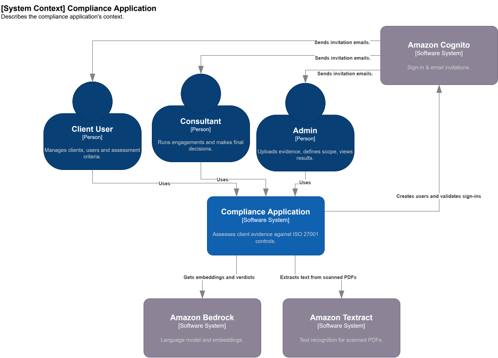


#### Containers for compliance application
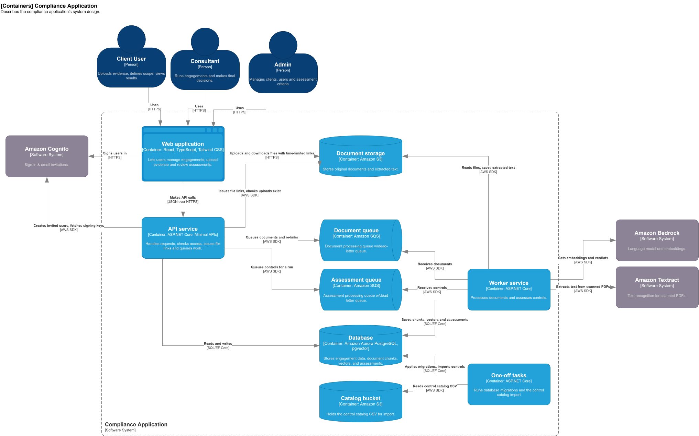


### Document Diagrams

#### Upload

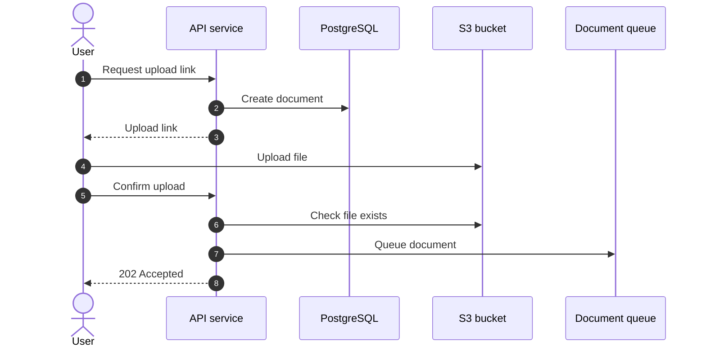
```mermaid
sequenceDiagram
    autonumber
    actor User as User
    participant API as API service
    participant DB as PostgreSQL
    participant S3 as S3 bucket
    participant Q as Document queue

    User->>API: Request upload link
    API->>DB: Create document
    API-->>User: Upload link
    User->>S3: Upload file
    User->>API: Confirm upload
    API->>S3: Check file exists
    API->>Q: Queue document
    API-->>User: 202 Accepted
```

#### Text Extraction

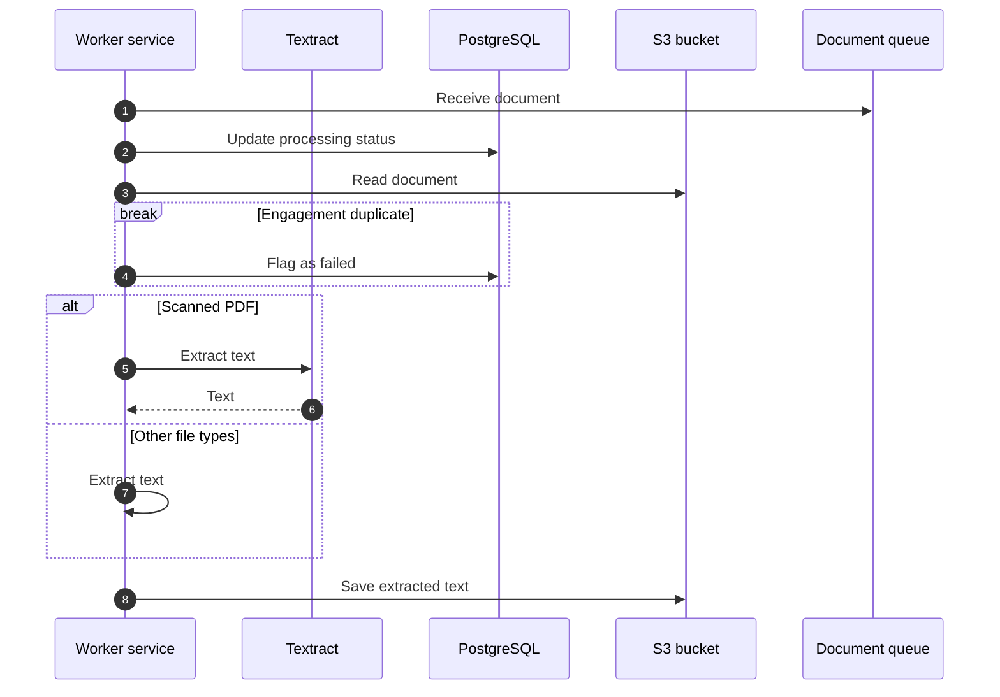
```mermaid
sequenceDiagram
    autonumber
    participant W as Worker service
    participant TX as Textract
    participant DB as PostgreSQL
    participant S3 as S3 bucket
    participant Q as Document queue

    W->>Q: Receive document
    W->>DB: Update processing status
    W->>S3: Read document
    break Engagement duplicate
        W->>DB: Flag as failed
    end 
    alt Scanned PDF
        W->>TX: Extract text
        TX-->>W: Text
    else Other file types
        W->>W: Extract text
    end
    W->>S3: Save extracted text
```

#### Indexing
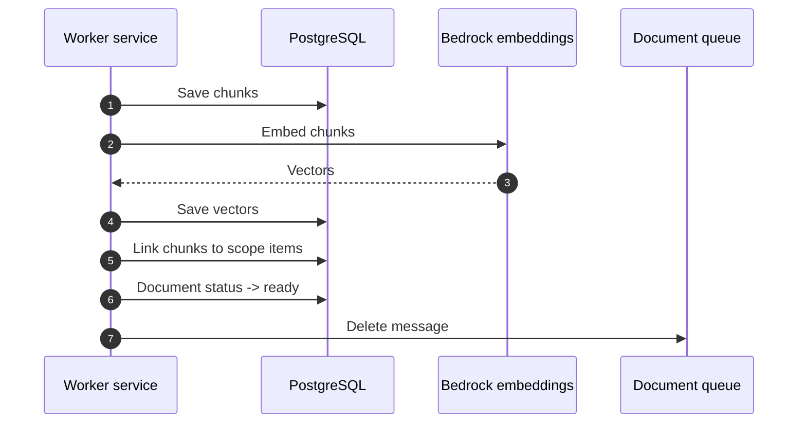
```mermaid
sequenceDiagram
    autonumber
    participant W as Worker service
    participant DB as PostgreSQL
    participant BR as Bedrock embeddings 
    participant Q as Document queue

    W->>DB: Save chunks
    W->>BR: Embed chunks
    BR-->>W: Vectors
    W->>DB: Save vectors
    W->>DB: Link chunks to scope items
    W->>DB: Document status -> ready
    W->>Q: Delete message
```

#### Status Check

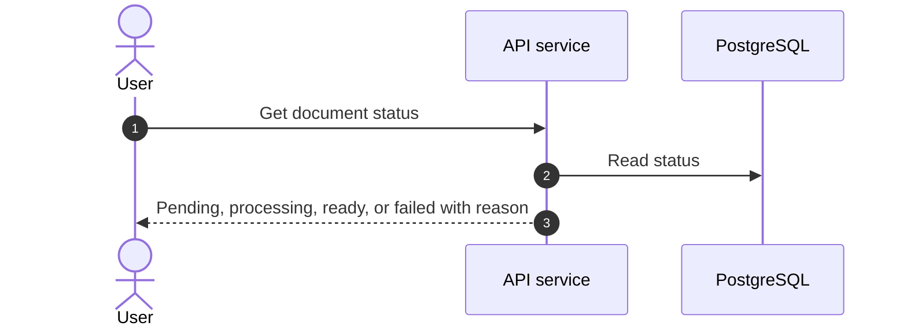
```mermaid
sequenceDiagram
    autonumber
    actor User as User
    participant API as API service
    participant DB as PostgreSQL

    User->>API: Get document status
    API->>DB: Read status
    API-->>User: Pending, processing, ready, or failed with reason
    
```

#### Retries
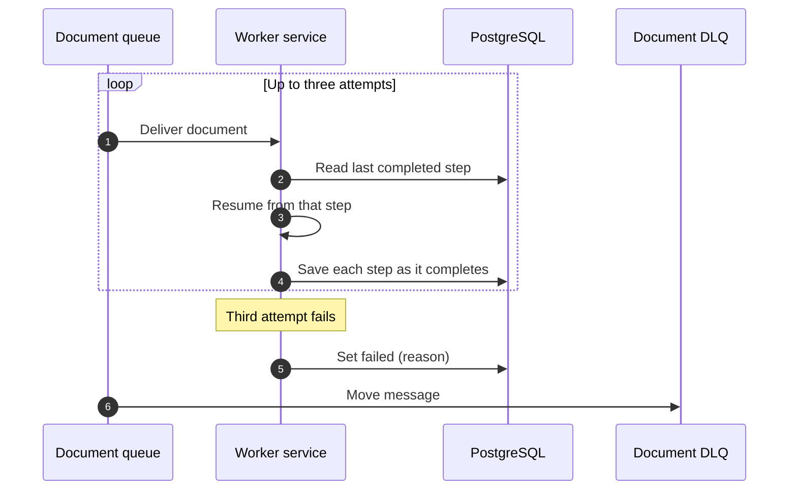
```mermaid
sequenceDiagram
    autonumber
    participant Q as Document queue
    participant W as Worker service
    participant DB as PostgreSQL
    participant DLQ as Document DLQ

    loop Up to three attempts
        Q->>W: Deliver document 
        W->>DB: Read last completed step
        W->>W: Resume from that step
        W->>DB: Save each step as it completes
    end
    
    Note over W: Third attempt fails
    W->>DB: Set failed (reason)
    Q->>DLQ: Move message
```

### Assessment Diagrams

#### Starting run
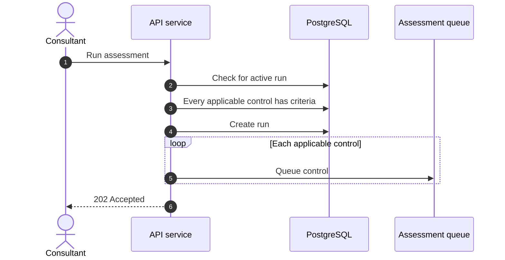
```mermaid
sequenceDiagram
    autonumber
    actor User as Consultant
    participant API as API service 
    participant DB as PostgreSQL
    participant SQS as Assessment queue

    User->>API: Run assessment
    API->>DB: Check for active run
    API->>DB: Every applicable control has criteria
    API->>DB: Create run
    loop Each applicable control
        API->>SQS: Queue control
    end
    API-->>User: 202 Accepted
```

#### Evidence search
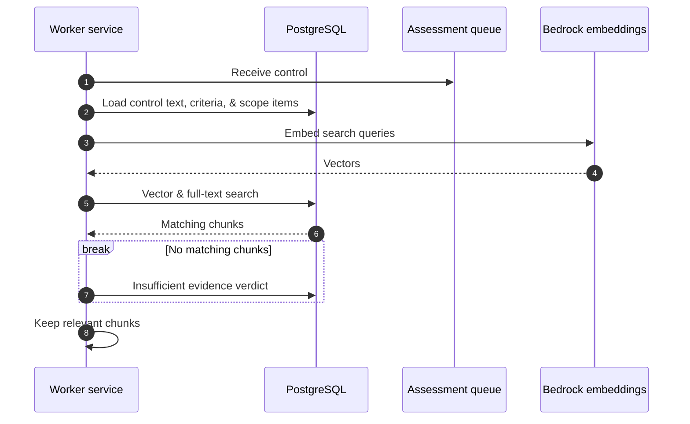
```mermaid
sequenceDiagram
    autonumber
    participant W as Worker service
    participant DB as PostgreSQL
    participant SQS as Assessment queue
    participant BR as Bedrock embeddings 

    W->>SQS: Receive control
    W->>DB: Load control text, criteria, & scope items
    W->>BR: Embed search queries
    BR-->>W: Vectors
    W->>DB: Vector & full-text search
    DB-->>W: Matching chunks
    break No matching chunks
        W->>DB: Insufficient evidence verdict
    end
    W->>W: Keep relevant chunks
```

#### Preliminary verdict

```mermaid
sequenceDiagram
    autonumber
    participant W as Worker service
    participant DB as PostgreSQL
    participant BR as Bedrock Claude 
    participant SQS as Assessment queue

    W->>W: Build prompt from template & context
    W->>BR: Query LLM 
    BR-->>W: Verdict, rationale, & citations
    W->>W: Check each quote against its chunk
    opt Pass/Fail w/o verified citation
        W->>W: Insufficient evidence verdict
    end
    W->>DB: Save assessment & citations
    W->>DB: Supersede previous assessment
    opt Earlier assessment had a decision
        W->>DB: Flag for re-review
    end
    W->>SQS: Delete message
```

#### Run completion
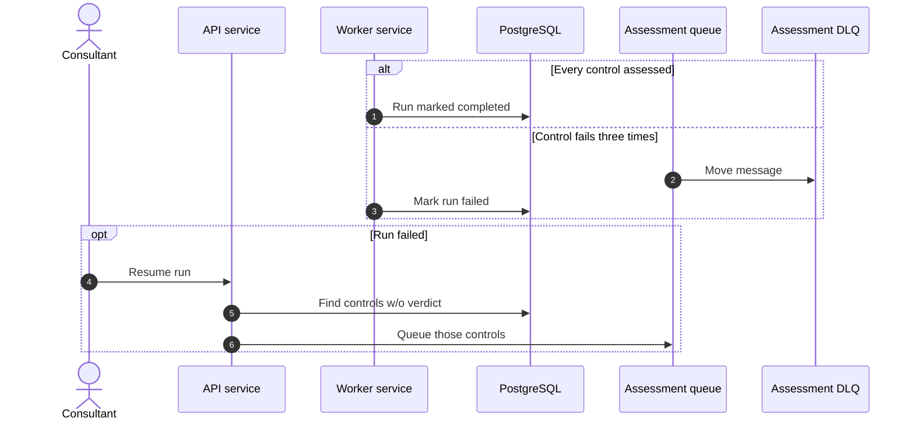
```mermaid
sequenceDiagram
        autonumber
        actor u as Consultant
        participant api as API service 
        participant w as Worker service 
        participant db as PostgreSQL
        participant q as Assessment queue
        participant dlq as Assessment DLQ

        alt Every control assessed
            w->>db: Run marked completed
        else Control fails three times
            q->>dlq: Move message
            w->>db: Mark run failed
        end

        opt Run failed
            u->>api: Resume run
            api->>db: Find controls w/o verdict
            api->>q: Queue those controls
        end
```

#### Consultant review
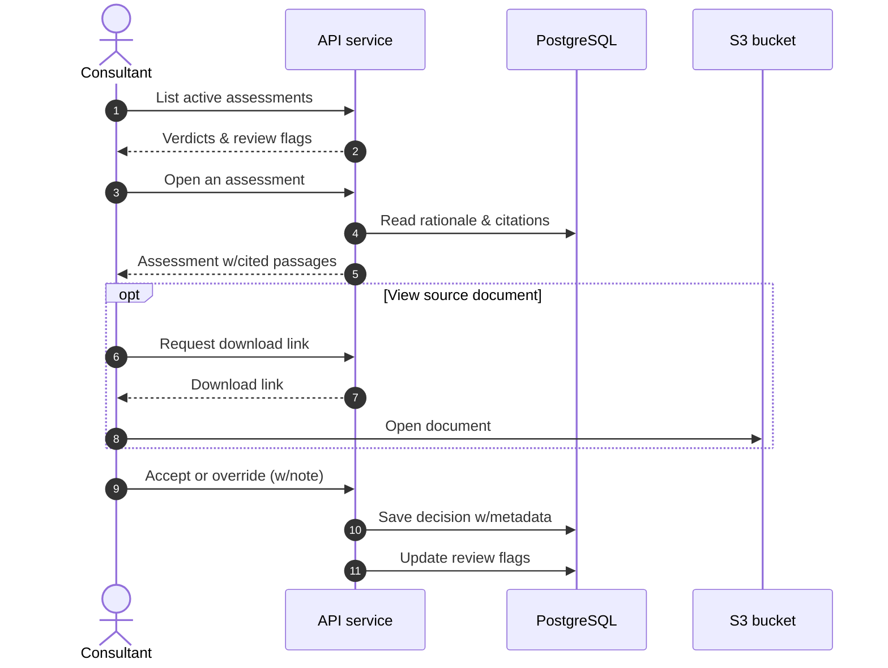
```mermaid
sequenceDiagram
    autonumber
    actor u as Consultant
    participant api as API service
    participant db as PostgreSQL
    participant s3 as S3 bucket

    u->>api: List active assessments
    api-->>u: Verdicts & review flags
    u->>api: Open an assessment
    api->>db: Read rationale & citations
    api-->>u: Assessment w/cited passages
    opt View source document
        u->>api: Request download link
        api-->>u: Download link
        u->>s3: Open document 
    end
    u->>api: Accept or override (w/note)
    api->>db: Save decision w/metadata
    api->>db: Update review flags
```

#### Evidence changes
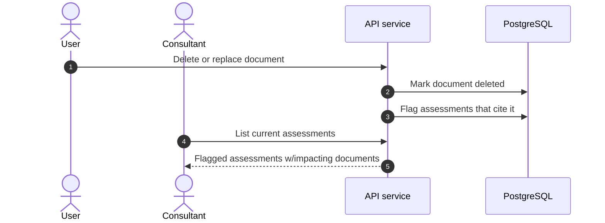
```mermaid
sequenceDiagram
    autonumber
    actor u as User
    actor c as Consultant 
    participant api as API service
    participant db as PostgreSQL
    u->>api: Delete or replace document
    api->>db: Mark document deleted
    api->>db: Flag assessments that cite it
    c->>api: List current assessments
    api-->>c: Flagged assessments w/impacting documents
```

#### Results
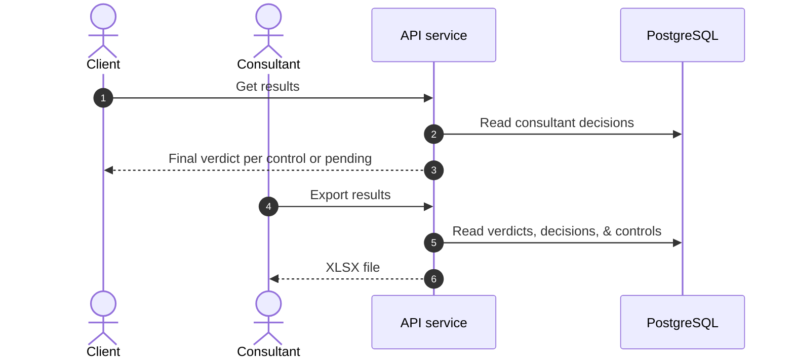
```mermaid
sequenceDiagram
        autonumber
        actor u as Client
        actor c as Consultant
        participant api as API service
        participant db as PostgreSQL

        u->>api: Get results
        api->>db: Read consultant decisions
        api-->>u: Final verdict per control or pending
        c->>api: Export results
        api->>db: Read verdicts, decisions, & controls
        api-->>c: XLSX file
```

### Access Management Diagrams

#### Inviting a user
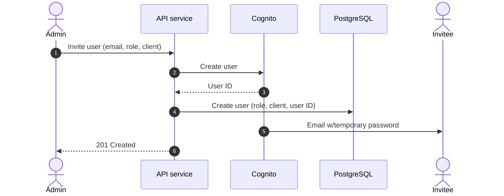
```mermaid
sequenceDiagram
    autonumber
    actor a as Admin
    participant api as API service
    participant auth as Cognito
    participant db as PostgreSQL
    actor i as Invitee

    a->>api: Invite user (email, role, client)
    api->>auth: Create user
    auth-->>api: User ID
    api->>db: Create user (role, client, user ID)
    auth->>i: Email w/temporary password
    api-->>a: 201 Created
```

#### Sign in
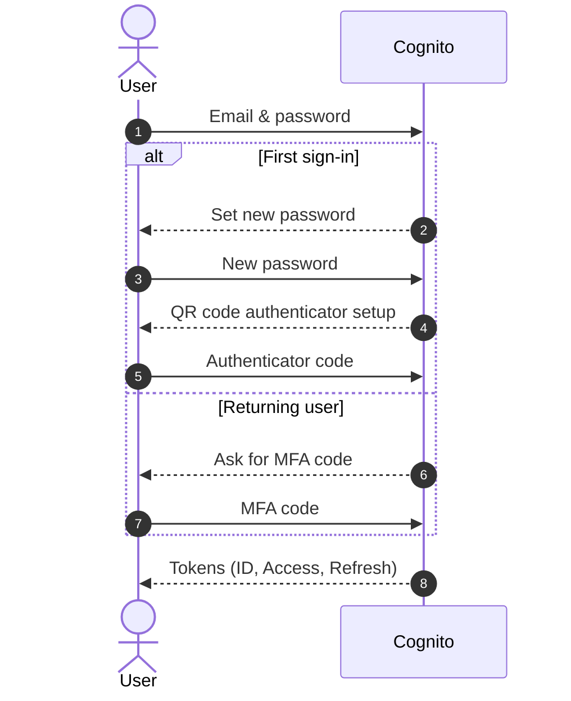
```mermaid
sequenceDiagram
        autonumber
        actor u as User
        participant auth as Cognito
        u->>auth: Email & password
        alt First sign-in
            auth-->>u: Set new password
            u->>auth: New password
            auth-->>u: QR code authenticator setup
            u->>auth: Authenticator code
        else Returning user
            auth-->>u: Ask for MFA code
            u->>auth: MFA code
        end
        auth-->>u: Tokens (ID, Access, Refresh)
```

#### Authenticated requests
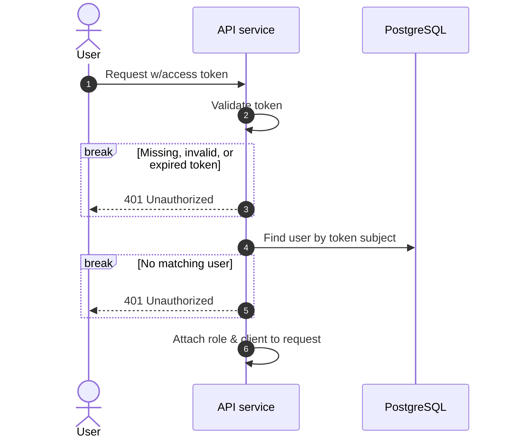
```mermaid
sequenceDiagram
    autonumber
    actor u as User
    participant api as API service
    participant db as PostgreSQL
    u->>api: Request w/access token
    api->>api: Validate token
    break Missing, invalid, or expired token
        api-->>u: 401 Unauthorized
    end
    api->>db: Find user by token subject
    break No matching user
        api-->>u: 401 Unauthorized
    end
    api->>api: Attach role & client to request
```

#### Engagement access
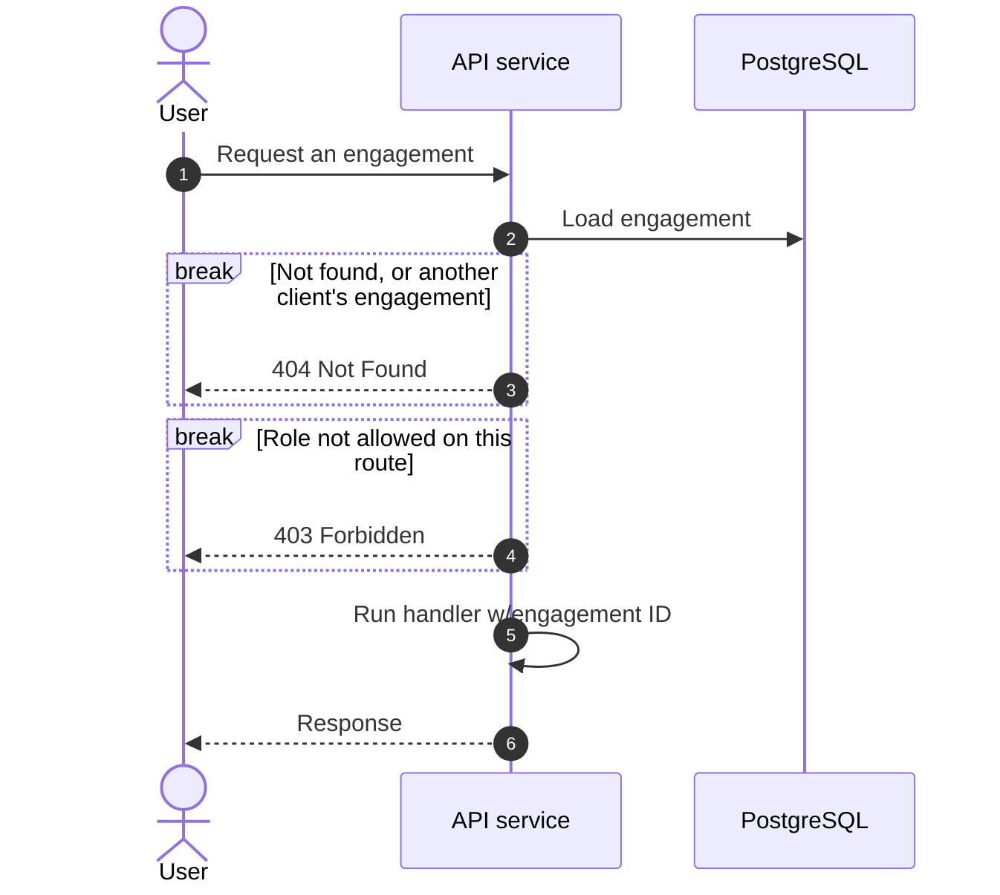
```mermaid
sequenceDiagram
    autonumber
    actor u as User
    participant api as API service
    participant db as PostgreSQL
    u->>api: Request an engagement
    api->>db: Load engagement
    break Not found, or another client's engagement
        api-->>u: 404 Not Found
    end
    break Role not allowed on this route
        api-->>u: 403 Forbidden
    end
    api->>api: Run handler w/engagement ID
    api-->>u: Response
    
```

### Engagement Setup Diagrams

#### Creating client & engagement
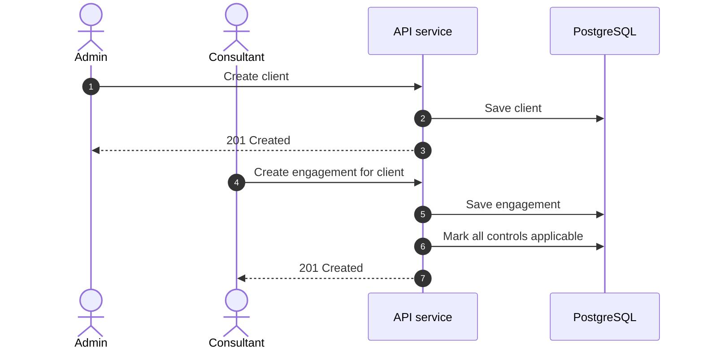
```mermaid
sequenceDiagram
        autonumber
        actor a as Admin
        actor c as Consultant
        participant api as API service
        participant db as PostgreSQL
        a->>api: Create client
        api->>db: Save client
        api-->>a: 201 Created
        c->>api: Create engagement for client
        api->>db: Save engagement
        api->>db: Mark all controls applicable
        api-->>c: 201 Created
```

#### Scope items
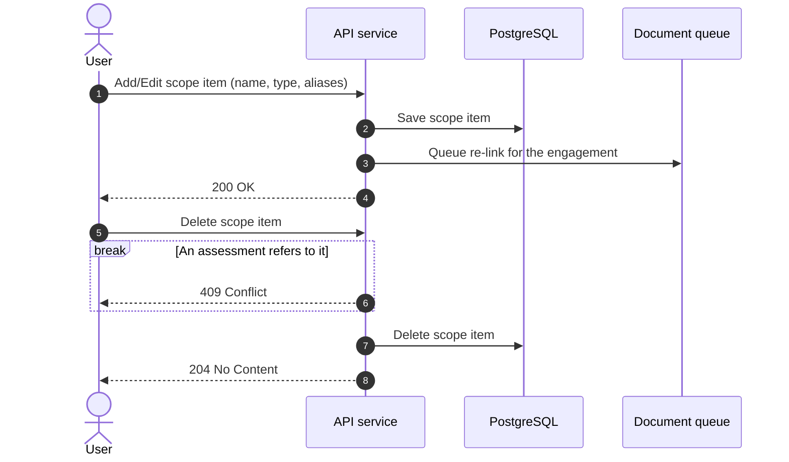
```mermaid
sequenceDiagram
        autonumber
        actor u as User
        participant api as API service
        participant db as PostgreSQL
        participant qu as Document queue
        u->>api: Add/Edit scope item (name, type, aliases)
        api->>db: Save scope item
        api->>qu: Queue re-link for the engagement
        api-->>u: 200 OK
        u->>api: Delete scope item
        break An assessment refers to it
            api-->>u: 409 Conflict
        end
        api->>db: Delete scope item
        api-->>u: 204 No Content
```

#### Applicability
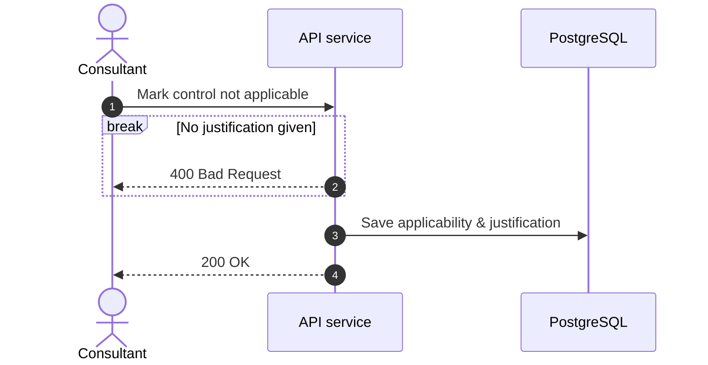
```mermaid
sequenceDiagram
        autonumber
        actor c as Consultant
        participant api as API service
        participant db as PostgreSQL
        c->>api: Mark control not applicable
        break No justification given
            api-->>c: 400 Bad Request
        end
        api->>db: Save applicability & justification
        api-->>c: 200 OK
```

#### Engagement state
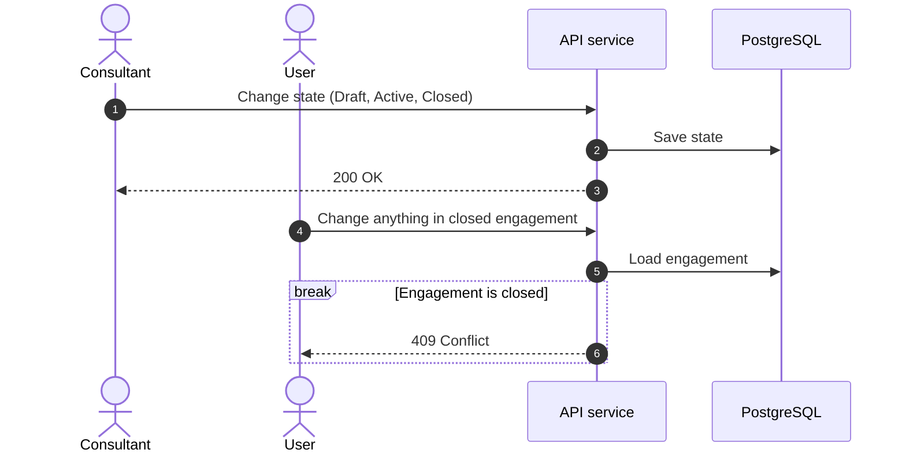
```mermaid
sequenceDiagram
        autonumber
        actor c as Consultant
        actor u as User
        participant api as API service
        participant db as PostgreSQL
        c->>api: Change state (Draft, Active, Closed)
        api->>db: Save state
        api-->>c: 200 OK
        u->>api: Change anything in closed engagement
        api->>db: Load engagement
        break Engagement is closed
            api-->>u: 409 Conflict
        end        
```

### Framework Management

#### Assessment criteria
```mermaid
sequenceDiagram
        autonumber
        actor a as Admin
        participant api as API service
        participant db as PostgreSQL
        a->>api: Add criteria version for control
        break Required fields missing
            api-->>a: 400 Bad Request
        end
        api->>db: Save version (inactive)
        api-->>a: 201 Created
        a->>api: Activate version
        critical Single transaction
            api->>db: Deactivate current version
            api->>db: Activate new version
        end
        api-->>a: 200 OK
```

### Deployment Diagrams

#### Prompt template change
```mermaid
sequenceDiagram
        autonumber
        actor dev as Developer
        participant ci as CI pipeline
        participant ws as Worker service

        dev->>dev: Add/Update template
        dev->>ci: Open pull request w/new version active
        ci->>ci: Build & test
        break Tests fail
            ci-->>dev: Failed, not merged
        end
        dev->>ci: Merge
        ci->>ws: Release
```

#### Release
```mermaid
sequenceDiagram
        autonumber
        actor dev as Developer
        participant ci as CI pipeline
        participant ecr as ECR
        participant mt as Migration task
        participant ecs as ECS services

        dev->>ci: Merge to main
        ci->>ci: Build and test
        break Build or tests fail
            ci-->>dev: Failed w/nothing deployed
        end
        ci->>ecr: Push image
        ci->>mt: Run migrations
        break Migrations fail
            ci-->>dev: Failed w/old version running
        end
        mt-->>ci: Done
        ci->>ecs: Deploy new image
        ecs->>ecs: Start new tasks, stop old ones once healthy
        ci-->>dev: Deployed
```

#### Catalog import
```mermaid
sequenceDiagram
        autonumber
        actor dev as Developer
        participant s3 as S3 bucket
        participant it as Import task
        participant db as PostgreSQL
        dev->>s3: Upload standards CSV
        dev->>it: Run import task
        it->>s3: Read CSV
        it->>it: Validate each row
        break Invalid row
            it-->>dev: Failed, no changes
        end
        it->>db: Insert/Update controls by reference ID
        it-->>dev: Summary of added/updated controls
```

#### Migrations
```mermaid
sequenceDiagram
        autonumber
        participant mt as Migration task
        participant db as PostgreSQL
        mt->>db: Read applied migrations
        mt->>db: Apply pending migrations
        Note over mt: Each migration must work w/version still runnincrg
```

### Miscellaneous Diagrams

#### Assessment influence
```mermaid
mindmap
  root((Assessment))
    App Scope
        Control Text
        Prompt Template
        Verdict Rules
    Firm Scope
        Assessment Criteria
    Engagement Scope
        Scope Items
        Evidence
```

**Rules the code keeps:**
- All data belongs to one engagement, and every query filters by it.
- Assessments and consultant decisions are never edited. A new run or decision adds a row.
- Code outside `Integrations/Aws/` uses only the interfaces in `Integrations/Abstractions/`.

## Build

Prerequisites:
- Visual Studio 2026 with the "ASP.NET and web development" workload, or the .NET 10 SDK with another editor
- Docker Desktop, for the local database and integration tests

In Visual Studio:
1. Open `ComplianceBackend.sln`.
2. Set `App` as the startup project and press F5.
3. Open `/health` to check the service is running, and `/scalar` to browse the API.

From a terminal at the repository root:

```
dotnet build
dotnet run --project src/App
```

## Test

Start Docker first: integration tests run PostgreSQL in a container.

In Visual Studio, open **Test > Test Explorer** and choose **Run All**. From a terminal:

```
dotnet test
```

Each test declares the requirement it proves with a `[Requirement("ID", "text")]` attribute. A requirement that isn't built yet is a skipped test, so a skipped test is pending work, not a failure.