# Compliance Backend

Backend system to facilitate audits via AI-assistance. 

Primary Offering:

1. New client onboarded.
1. Works with consultant to define frameworks, scope, and controls.
1. Client uploads evidence documents.
1. AI determines presents it verdicts and evidence on a per-control basis.
1. Auditors review the findings and evidence to provide the final say on a per-control basis.
1. Report generated according to firm-provided DOCX template.


The primary feature enables clients and consultants to upload evidence documents, the system assesses each control against that evidence. It presents the preliminary verdict, reasoning, and cited evidence to the consultant who makes the final decision.

## Tech stack

| Concern | Choice |
|---|---|
| Language and runtime | C# on .NET 10 |
| Web framework | ASP.NET Core minimal APIs |
| Background work | Hosted services in the same application |
| Database | Amazon Aurora PostgreSQL with pgvector |
| Data access | EF Core with Npgsql |
| File storage | Amazon S3 |
| Queues | Amazon SQS + DLQs|
| Language model and embeddings | Claude and Titan Text Embeddings V2 through Amazon Bedrock |
| Text recognition | Amazon Textract, for scanned PDFs |
| Sign-in | Amazon Cognito w/MFA |
| Hosting | Amazon ECS on Fargate |
| Infrastructure | AWS CDK in C# |
| API reference | OpenAPI document + Scalar browser |
| Tests | xUnit, Testcontainers |

## Project structure

```
ComplianceBackend.sln
Directory.Build.props        shared build settings for every project
DECISIONS.md                 hard-to-reverse design choices
docs/                        generated files; never edit by hand
src/App/                     the application: API and worker in one project
  Program.cs
  Features/                  one folder per feature: endpoints, request types, service
  Pipeline/                  queue consumers and document processing steps
  Integrations/
    Abstractions/            interfaces the rest of the code depends on
    Aws/                     S3, SQS, Textract and Bedrock implementations
  Data/                      DbContext, entity configurations, migrations
  Common/                    sign-in, access checks, errors, paging
tests/App.Tests/             unit and integration tests
infra/                       CDK project
```

Folders are created when their first file is added.

## Architecture

The backend application is a single application image that may run as 3 services. The first service is the REST API service. This service provides responses to HTTP requests. The second service is the Worker service. This service handles the backend processing of files and queues. The third service is the One-Off service. This service handles one-off tasks like migration or import tasks.

### System Context & Containers Diagrams

#### System context


#### Containers


### Infrastructure
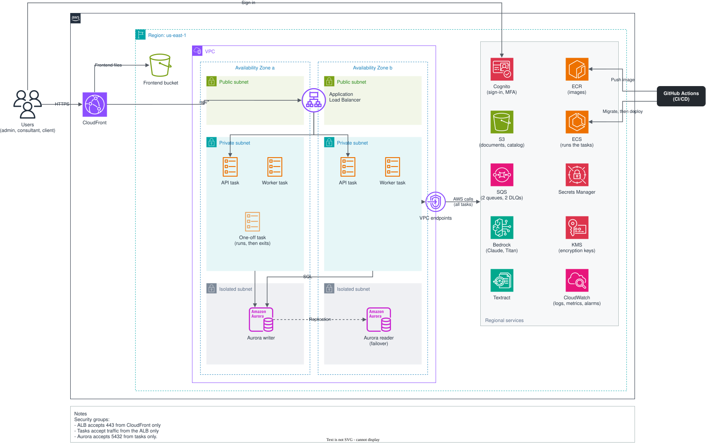

### Database

```mermaid
---
title: Compliance assessment schema (v2.4)
---
%% Target: Aurora PostgreSQL 15 or later, with pgvector 0.8 or later.
%% Primary keys are UUIDv7, generated by the application, so they sort by creation time.
%% Mermaid cannot draw enums, indexes or CHECKs. Enum values are listed below.
%% Indexes and constraints are listed in a comment above each table.
%% -
%% ---------- Enums ----------
%% user_role: consultant, admin, client
%% engagement_status: draft, active, closed
%% scope_item_type: system, asset, vendor
%% document_status: pending, processing, ready, failed
%% mapping_relationship: equivalent, subset, superset, related
%% mention_method: alias, llm
%% run_status: queued, running, completed, failed
%% preliminary_verdict: preliminary_pass, preliminary_fail, interpretation_required, insufficient_evidence
%% final_verdict: pass, fail, insufficient_evidence
%% review_flag_reason: decision_superseded, document_deleted, document_replaced
%% -
%% ---------- Engagement isolation ----------
%% Every table with engagement_id references its engagement-scoped parents by (id, engagement_id).
%% Each parent has UNIQUE (id, engagement_id) for this. A row can never point into another engagement.
%% -
%% ---------- Application rules (not enforced by the database) ----------
%% Only a consultant or admin can lead an engagement, start a run or record a decision.
%% A closed engagement is read-only. The access check enforces this.
%% Recording a decision locks the assessment (SELECT ... FOR SHARE) and returns 409 if it is no longer current.
%% Open-flag counts include only flags on current assessments.
%% Search queries repeat the partial HNSW index condition exactly; a test checks the plan uses the index.
%% Every engagement write locks the engagement row FOR SHARE; closing locks it FOR UPDATE.
%% Adding or activating criteria locks the control's row first.
%% Saving an assessment: lock and un-current the earlier assessment, read its decisions, lock the cited
%% chunks and drop citations to deleted ones, then insert the assessment, citations and any flag.
%% Only the engagement's latest run can be resumed.
%% The sweeper fails unconfirmed uploads after 30 minutes and runs with no progress for 30 minutes.
%% A decision is "accepted" when final_verdict matches the preliminary verdict
%% (preliminary_pass to pass, preliminary_fail to fail, insufficient_evidence to insufficient_evidence).
%% Any other final verdict is an override and needs a note. interpretation_required can only be overridden.
%% -
%% -
%% ---------- Deferred to phase two ----------
%% Per-scope-item verdicts: add scope_item_id to assessment_run_controls and widen both run keys.
%% -
%% Not drawn, to keep the picture readable: every engagement_id foreign key, and
%% engagement_controls.updated_by_id, scope_items.created_by_id, assessment_criteria.created_by_id,
%% documents.uploaded_by_id and review_flags.cleared_by_id. Each is marked FK in its table.
erDiagram

    %% ---------- People and engagements ----------

    %% UNIQUE lower(email).
    %% CHECK (role = 'client') = (client_id IS NOT NULL).
    users {
        uuid id PK
        text external_id UK "Cognito subject, set when the user is invited"
        text email UK "Unique ignoring case"
        text display_name
        user_role role "No default; every invite names the role"
        uuid client_id FK "Set for client users only"
        timestamptz disabled_at "Set when an admin disables the user"
        timestamptz created_at
    }

    clients {
        uuid id PK
        text name
        timestamptz created_at
    }

    %% Isolation boundary. Every engagement-scoped table carries engagement_id.
    engagements {
        uuid id PK
        uuid client_id FK
        uuid lead_consultant_id FK
        text name
        engagement_status status "default draft"
        timestamptz created_at
    }

    engagement_frameworks {
        uuid engagement_id PK, FK
        uuid framework_id PK, FK
    }

    %% One row per control of each framework in the engagement. Rows are created when a framework
    %% is attached, and the catalog import adds rows for any new control of that framework.
    %% FK (engagement_id, framework_id) to engagement_frameworks.
    %% FK (control_id, framework_id) to controls (id, framework_id).
    %% CHECK is_applicable OR justification IS NOT NULL.
    engagement_controls {
        uuid engagement_id PK, FK
        uuid control_id PK, FK
        uuid framework_id FK
        boolean is_applicable "default true"
        text justification "Required when not applicable"
        uuid updated_by_id FK
        timestamptz updated_at
    }

    %% Hard-deleted; their mentions are deleted with them (cascade).
    %% UNIQUE (engagement_id, type, name). UNIQUE (id, engagement_id).
    scope_items {
        uuid id PK
        uuid engagement_id FK
        scope_item_type type
        text name
        text_array aliases "Alternate names used for entity matching"
        text description
        uuid created_by_id FK "Client user or consultant"
        timestamptz created_at
    }

    %% ---------- Framework catalog (loaded by the catalog import task) ----------

    %% UNIQUE (key, version).
    frameworks {
        uuid id PK
        text key "e.g. iso_27001"
        text name
        text version "e.g. 2022"
    }

    %% Loaded by import-catalog from a private S3 bucket, in one transaction. Never deleted.
    %% UNIQUE (framework_id, ref_code). UNIQUE (id, framework_id).
    %% CHECK theme IN ('organizational', 'people', 'physical', 'technological').
    controls {
        uuid id PK
        uuid framework_id FK
        text ref_code "e.g. 5.1, 8.24"
        text theme
        text title
        text statement "The standard's own text. Licensed; never in the repository"
    }

    %% Insert-only apart from is_active.
    %% UNIQUE (control_id, version). UNIQUE (control_id, id).
    %% Partial unique (control_id) WHERE is_active: one active version per control.
    assessment_criteria {
        uuid id PK
        uuid control_id FK
        int version
        text_array expected_evidence "One entry per kind of evidence; each is a search query"
        text pass_conditions
        text fail_conditions
        boolean requires_operation_evidence "default false"
        boolean is_active "default false"
        uuid created_by_id FK
        timestamptz created_at
    }

    %% Empty in phase one.
    %% UNIQUE (source_control_id, target_control_id). CHECK source_control_id <> target_control_id.
    control_mappings {
        uuid id PK
        uuid source_control_id FK
        uuid target_control_id FK
        mapping_relationship relationship
        text provider
        timestamptz fetched_at
    }

    %% ---------- Documents and retrieval ----------

    %% A replacement retires the old document: when it is ready, the old document and its chunks
    %% get deleted_at in the same transaction.
    %% UNIQUE (id, engagement_id).
    %% Partial unique (engagement_id, content_hash) WHERE deleted_at IS NULL AND status <> 'failed'.
    %% Partial unique (replaces_document_id) WHERE deleted_at IS NULL AND status <> 'failed'.
    %% CHECK replaces_document_id <> id.
    %% FK (replaces_document_id, engagement_id) to documents (id, engagement_id).
    %% CHECK text_source IN ('embedded', 'text_recognition').
    %% CHECK (status = 'failed') = (error IS NOT NULL).
    %% Index (engagement_id, status).
    %% Trigger: AFTER UPDATE OF deleted_at copies the value to the document's existing chunks.
    documents {
        uuid id PK
        uuid engagement_id FK
        uuid uploaded_by_id FK
        text file_name
        text mime_type
        bigint size_bytes
        int page_count
        text content_hash "SHA-256 of the original file; set by the check step"
        text s3_key "Chosen by the server from the document ID"
        text s3_version_id "Recorded at confirm; the worker and downloads use only this version"
        text extracted_s3_key "Extracted text and locations as JSON"
        text text_source
        uuid replaces_document_id FK
        timestamptz deleted_at "Soft delete; search excludes"
        document_status status "default pending"
        text processing_step "Last completed step, for retries"
        text error "Set only when failed"
        timestamptz confirmed_at "Set when the upload is confirmed"
        timestamptz created_at
    }

    %% UNIQUE (id, engagement_id).
    %% FK (document_id, engagement_id) to documents (id, engagement_id).
    %% Partial unique (document_id, chunk_index) WHERE superseded_at IS NULL.
    %% HNSW on embedding (cosine) WHERE deleted_at IS NULL AND superseded_at IS NULL.
    %% Search sets hnsw.iterative_scan and filters on embedding_model.
    %% GIN on search_vector. Index (engagement_id). Index (document_id).
    %% Trigger: BEFORE INSERT copies the document's deleted_at, so chunks written after a delete stay hidden.
    document_chunks {
        uuid id PK
        uuid document_id FK
        uuid engagement_id FK "Denormalized for filtered search"
        int chunk_index
        jsonb locator "page, sheet and range, or slide"
        text section_title
        text content
        int token_count
        vector_1024 embedding "Matches the Bedrock embedding model"
        text embedding_model
        text chunker "e.g. xlsx-rows-v2"
        timestamptz superseded_at "Set by re-chunking; search excludes"
        timestamptz deleted_at "Copied from the document by triggers; search excludes"
        tsvector search_vector "Generated from content"
    }

    %% FK (chunk_id, engagement_id) to document_chunks (id, engagement_id).
    %% FK (scope_item_id, engagement_id) to scope_items (id, engagement_id).
    %% Index (scope_item_id). The scope item FK cascades on delete.
    chunk_scope_mentions {
        uuid chunk_id PK, FK
        uuid scope_item_id PK, FK
        uuid engagement_id FK
        text matched_text
        mention_method method
    }

    %% ---------- Assessments and review ----------

    %% UNIQUE (id, engagement_id). Index (engagement_id, created_at).
    %% Partial unique (engagement_id) WHERE status IN ('queued', 'running'): one active run per engagement.
    assessment_runs {
        uuid id PK
        uuid engagement_id FK
        uuid triggered_by_id FK "Consultant or admin"
        text model_id "Bedrock model identifier"
        text prompt_version
        run_status status "default queued"
        timestamptz started_at
        timestamptz completed_at
        timestamptz created_at
    }

    %% One row per control a run queues, with the criteria version active at the start.
    %% FK (control_id, assessment_criteria_id) to assessment_criteria (control_id, id).
    %% A row is finished when it has an assessment or failed_at is set.
    %% CHECK (failed_at IS NULL) = (error IS NULL).
    assessment_run_controls {
        uuid run_id PK, FK
        uuid control_id PK, FK
        uuid assessment_criteria_id FK
        timestamptz failed_at "Set after the last retry fails"
        text error
    }

    %% Append-only apart from is_current.
    %% UNIQUE (id, engagement_id). UNIQUE (run_id, control_id).
    %% FK (run_id, control_id) to assessment_run_controls; the criteria version comes from there.
    %% FK (run_id, engagement_id) to assessment_runs (id, engagement_id).
    %% FK (scope_item_id, engagement_id) to scope_items (id, engagement_id).
    %% Partial unique (engagement_id, control_id, scope_item_id) NULLS NOT DISTINCT WHERE is_current.
    assessments {
        uuid id PK
        uuid run_id FK
        uuid engagement_id FK
        uuid control_id FK
        uuid scope_item_id FK "Always null in phase one"
        preliminary_verdict verdict
        text rationale
        boolean is_current "default true"
        timestamptz created_at
    }

    %% FK (assessment_id, engagement_id) to assessments (id, engagement_id).
    %% FK (chunk_id, engagement_id) to document_chunks (id, engagement_id).
    %% CHECK (is_verified AND char_start IS NOT NULL AND char_end > char_start)
    %%    OR (NOT is_verified AND char_start IS NULL AND char_end IS NULL).
    %% Index (assessment_id). Index (chunk_id).
    evidence_citations {
        uuid id PK
        uuid assessment_id FK
        uuid chunk_id FK
        uuid engagement_id FK
        text quoted_text
        int char_start "Character offset in the chunk's content; null if unverified"
        int char_end "Null if unverified"
        boolean is_verified "True when the quote was found in the chunk"
    }

    %% A decision_superseded flag goes on the new assessment and names the one it replaced.
    %% FK (assessment_id, engagement_id) to assessments (id, engagement_id).
    %% FK (document_id, engagement_id) to documents (id, engagement_id).
    %% CHECK (reason IN ('document_deleted', 'document_replaced')) = (document_id IS NOT NULL).
    %% FK (superseded_assessment_id, engagement_id) to assessments (id, engagement_id).
    %% CHECK (reason = 'decision_superseded') = (superseded_assessment_id IS NOT NULL).
    %% CHECK (cleared_at IS NULL) = (cleared_by_id IS NULL).
    %% Partial unique (assessment_id, reason, document_id) NULLS NOT DISTINCT WHERE cleared_at IS NULL.
    %% Index (assessment_id) WHERE cleared_at IS NULL. Index (engagement_id) WHERE cleared_at IS NULL.
    review_flags {
        uuid id PK
        uuid assessment_id FK
        uuid engagement_id FK
        review_flag_reason reason
        uuid document_id FK "The deleted or replaced document"
        uuid superseded_assessment_id FK "The earlier assessment that had the decision"
        timestamptz created_at
        timestamptz cleared_at "Set when a consultant has re-reviewed"
        uuid cleared_by_id FK
    }

    %% Append-only. The decision of record is the latest by (decided_at, id).
    %% Index (assessment_id, decided_at DESC, id DESC).
    consultant_decisions {
        uuid id PK
        uuid assessment_id FK
        uuid decided_by_id FK "Consultant or admin"
        final_verdict final_verdict
        text notes "Required for an override"
        timestamptz decided_at "default now()"
    }

    %% Append-only record of every change (RV-6). engagement_id is null for firm-level actions.
    %% FK (engagement_id) to engagements. Index (engagement_id, occurred_at). Index (entity_type, entity_id).
    audit_events {
        uuid id PK
        uuid engagement_id FK
        uuid actor_id FK
        text action "e.g. scope_item.updated, applicability.set, document.deleted"
        text entity_type
        uuid entity_id
        jsonb details "Changed fields, old and new values"
        timestamptz occurred_at "default now()"
    }

    %% ---------- Relationships ----------

    clients ||--o{ users : "has client users"
    clients ||--o{ engagements : "has"
    users ||--o{ engagements : "leads"
    engagements ||--o{ engagement_frameworks : "uses"
    frameworks ||--o{ engagement_frameworks : "used by"
    engagements ||--o{ engagement_controls : "sets applicability"
    engagement_frameworks ||--o{ engagement_controls : "provides controls"
    controls ||--o{ engagement_controls : "applies to"
    engagements ||--o{ scope_items : "covers"

    frameworks ||--o{ controls : "contains"
    controls ||--o{ assessment_criteria : "has versions"
    controls ||--o{ control_mappings : "maps from"
    controls ||--o{ control_mappings : "maps to"

    engagements ||--o{ documents : "holds"
    documents |o--o| documents : "replaces"
    documents ||--o{ document_chunks : "split into"
    document_chunks ||--o{ chunk_scope_mentions : "mentions"
    scope_items ||--o{ chunk_scope_mentions : "mentioned in"

    engagements ||--o{ assessment_runs : "runs"
    users ||--o{ assessment_runs : "starts"
    assessment_runs ||--|{ assessment_run_controls : "queues"
    controls ||--o{ assessment_run_controls : "queued as"
    assessment_criteria ||--o{ assessment_run_controls : "snapshotted in"
    assessment_run_controls ||--o| assessments : "assessed as"
    scope_items |o--o{ assessments : "scoped to"
    assessments ||--o{ evidence_citations : "cites"
    document_chunks ||--o{ evidence_citations : "quoted in"
    assessments ||--o{ review_flags : "flagged by"
    documents |o--o{ review_flags : "named in"
    assessments ||--o{ consultant_decisions : "decided by"
    users ||--o{ consultant_decisions : "records"
    assessments |o--o{ review_flags : "superseded in"
    engagements |o--o{ audit_events : "logs"
    users ||--o{ audit_events : "acts in"
```

### Document Diagrams

#### Upload

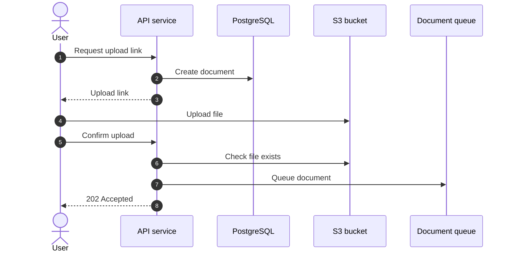
```mermaid
sequenceDiagram
    autonumber
    actor User as User
    participant API as API service
    participant DB as PostgreSQL
    participant S3 as S3 bucket
    participant Q as Document queue

    User->>API: Request upload link
    API->>DB: Create document
    API-->>User: Upload link
    User->>S3: Upload file
    User->>API: Confirm upload
    API->>S3: Check file exists
    API->>Q: Queue document
    API-->>User: 202 Accepted
```

#### Text Extraction

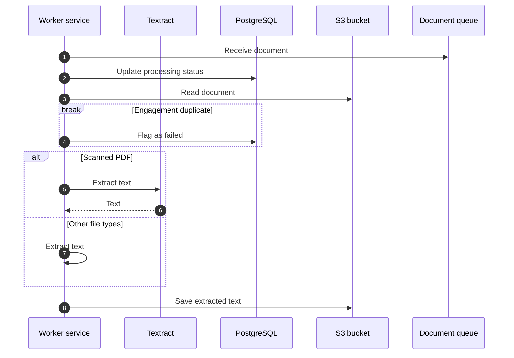
```mermaid
sequenceDiagram
    autonumber
    participant W as Worker service
    participant TX as Textract
    participant DB as PostgreSQL
    participant S3 as S3 bucket
    participant Q as Document queue

    W->>Q: Receive document
    W->>DB: Update processing status
    W->>S3: Read document
    break Engagement duplicate
        W->>DB: Flag as failed
    end 
    alt Scanned PDF
        W->>TX: Extract text
        TX-->>W: Text
    else Other file types
        W->>W: Extract text
    end
    W->>S3: Save extracted text
```

#### Indexing
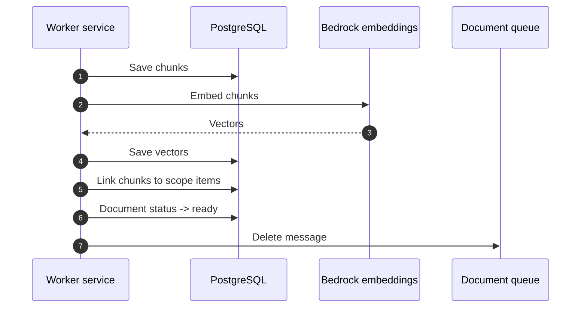
```mermaid
sequenceDiagram
    autonumber
    participant W as Worker service
    participant DB as PostgreSQL
    participant BR as Bedrock embeddings 
    participant Q as Document queue

    W->>DB: Save chunks
    W->>BR: Embed chunks
    BR-->>W: Vectors
    W->>DB: Save vectors
    W->>DB: Link chunks to scope items
    W->>DB: Document status -> ready
    W->>Q: Delete message
```

#### Status Check

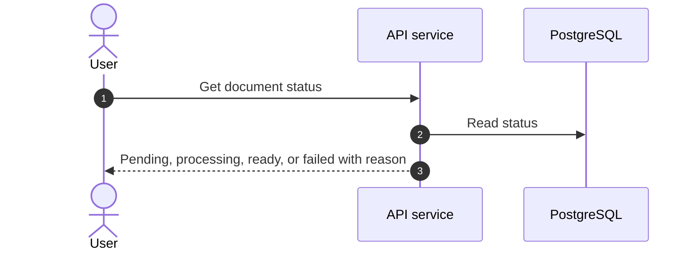
```mermaid
sequenceDiagram
    autonumber
    actor User as User
    participant API as API service
    participant DB as PostgreSQL

    User->>API: Get document status
    API->>DB: Read status
    API-->>User: Pending, processing, ready, or failed with reason
    
```

#### Retries
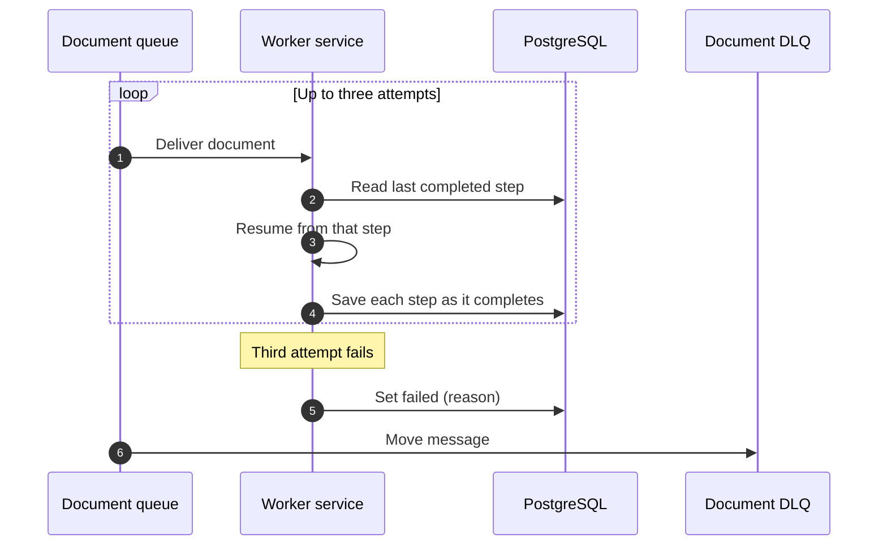
```mermaid
sequenceDiagram
    autonumber
    participant Q as Document queue
    participant W as Worker service
    participant DB as PostgreSQL
    participant DLQ as Document DLQ

    loop Up to three attempts
        Q->>W: Deliver document 
        W->>DB: Read last completed step
        W->>W: Resume from that step
        W->>DB: Save each step as it completes
    end
    
    Note over W: Third attempt fails
    W->>DB: Set failed (reason)
    Q->>DLQ: Move message
```

### Assessment Diagrams

#### Starting run
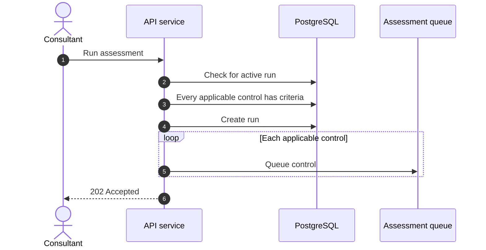
```mermaid
sequenceDiagram
    autonumber
    actor User as Consultant
    participant API as API service 
    participant DB as PostgreSQL
    participant SQS as Assessment queue

    User->>API: Run assessment
    API->>DB: Check for active run
    API->>DB: Every applicable control has criteria
    API->>DB: Create run
    loop Each applicable control
        API->>SQS: Queue control
    end
    API-->>User: 202 Accepted
```

#### Evidence search
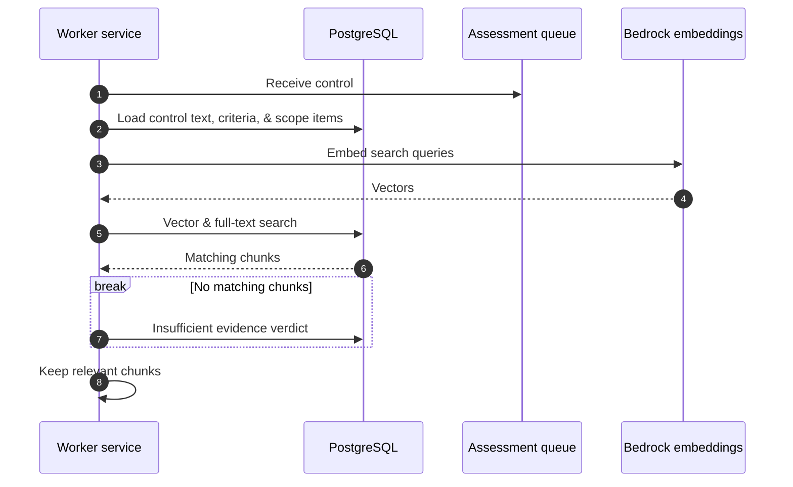
```mermaid
sequenceDiagram
    autonumber
    participant W as Worker service
    participant DB as PostgreSQL
    participant SQS as Assessment queue
    participant BR as Bedrock embeddings 

    W->>SQS: Receive control
    W->>DB: Load control text, criteria, & scope items
    W->>BR: Embed search queries
    BR-->>W: Vectors
    W->>DB: Vector & full-text search
    DB-->>W: Matching chunks
    break No matching chunks
        W->>DB: Insufficient evidence verdict
    end
    W->>W: Keep relevant chunks
```

#### Preliminary verdict

```mermaid
sequenceDiagram
    autonumber
    participant W as Worker service
    participant DB as PostgreSQL
    participant BR as Bedrock Claude 
    participant SQS as Assessment queue

    W->>W: Build prompt from template & context
    W->>BR: Query LLM 
    BR-->>W: Verdict, rationale, & citations
    W->>W: Check each quote against its chunk
    opt Pass/Fail w/o verified citation
        W->>W: Insufficient evidence verdict
    end
    W->>DB: Save assessment & citations
    W->>DB: Supersede previous assessment
    opt Earlier assessment had a decision
        W->>DB: Flag for re-review
    end
    W->>SQS: Delete message
```

#### Run completion
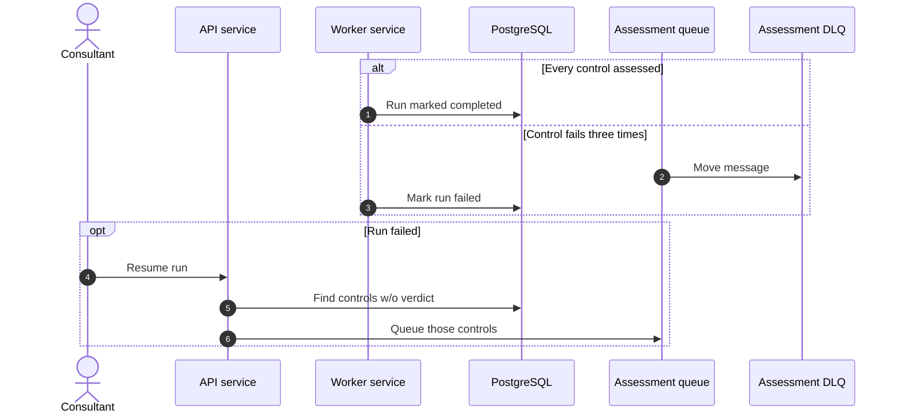
```mermaid
sequenceDiagram
        autonumber
        actor u as Consultant
        participant api as API service 
        participant w as Worker service 
        participant db as PostgreSQL
        participant q as Assessment queue
        participant dlq as Assessment DLQ

        alt Every control assessed
            w->>db: Run marked completed
        else Control fails three times
            q->>dlq: Move message
            w->>db: Mark run failed
        end

        opt Run failed
            u->>api: Resume run
            api->>db: Find controls w/o verdict
            api->>q: Queue those controls
        end
```

#### Consultant review
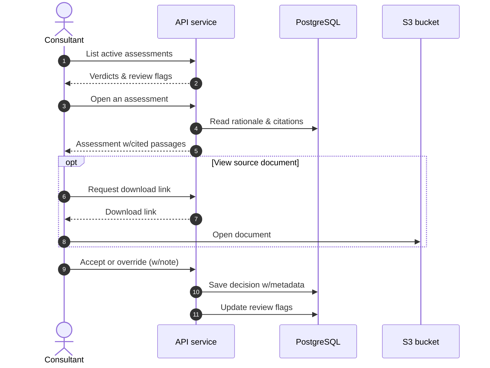
```mermaid
sequenceDiagram
    autonumber
    actor u as Consultant
    participant api as API service
    participant db as PostgreSQL
    participant s3 as S3 bucket

    u->>api: List active assessments
    api-->>u: Verdicts & review flags
    u->>api: Open an assessment
    api->>db: Read rationale & citations
    api-->>u: Assessment w/cited passages
    opt View source document
        u->>api: Request download link
        api-->>u: Download link
        u->>s3: Open document 
    end
    u->>api: Accept or override (w/note)
    api->>db: Save decision w/metadata
    api->>db: Update review flags
```

#### Evidence changes
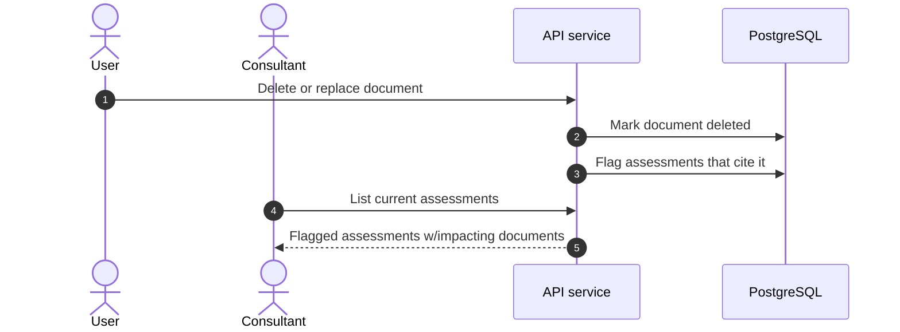
```mermaid
sequenceDiagram
    autonumber
    actor u as User
    actor c as Consultant 
    participant api as API service
    participant db as PostgreSQL
    u->>api: Delete or replace document
    api->>db: Mark document deleted
    api->>db: Flag assessments that cite it
    c->>api: List current assessments
    api-->>c: Flagged assessments w/impacting documents
```

#### Results
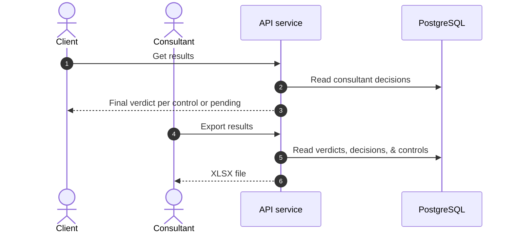
```mermaid
sequenceDiagram
        autonumber
        actor u as Client
        actor c as Consultant
        participant api as API service
        participant db as PostgreSQL

        u->>api: Get results
        api->>db: Read consultant decisions
        api-->>u: Final verdict per control or pending
        c->>api: Export results
        api->>db: Read verdicts, decisions, & controls
        api-->>c: XLSX file
```

### Access Management Diagrams

#### Inviting a user
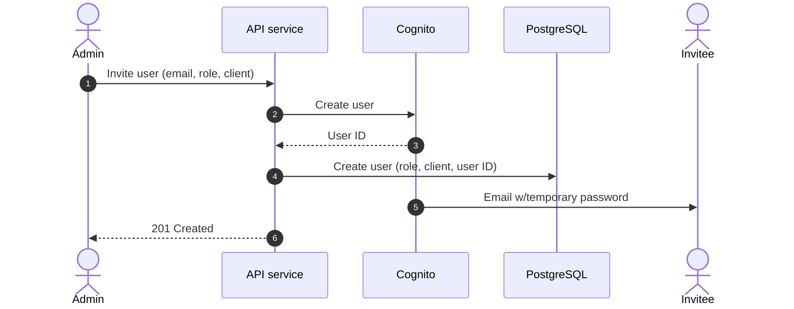
```mermaid
sequenceDiagram
    autonumber
    actor a as Admin
    participant api as API service
    participant auth as Cognito
    participant db as PostgreSQL
    actor i as Invitee

    a->>api: Invite user (email, role, client)
    api->>auth: Create user
    auth-->>api: User ID
    api->>db: Create user (role, client, user ID)
    auth->>i: Email w/temporary password
    api-->>a: 201 Created
```

#### Sign in
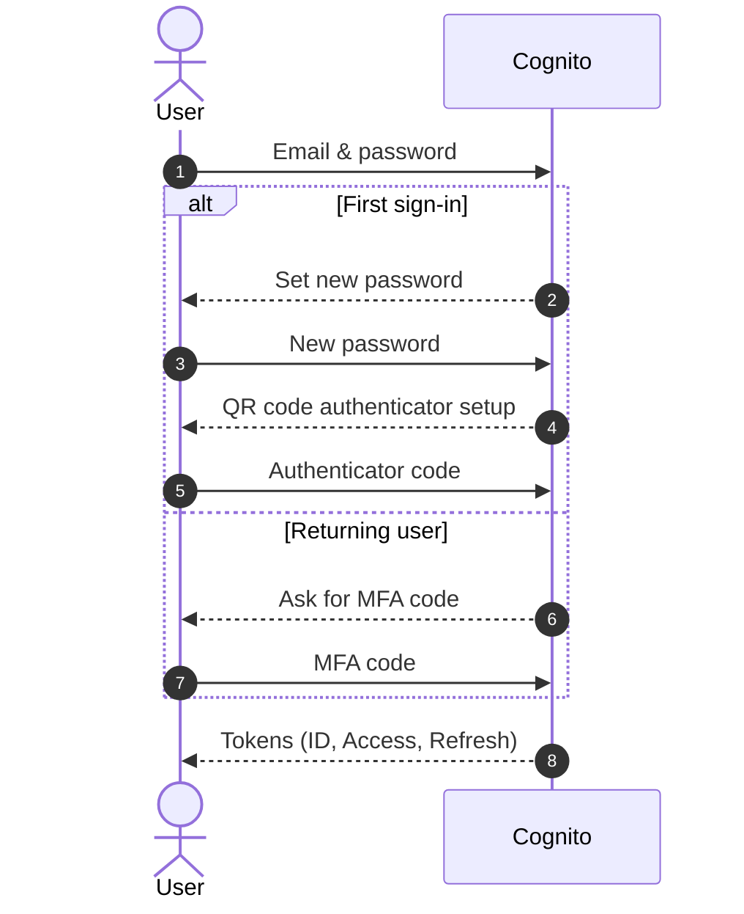
```mermaid
sequenceDiagram
        autonumber
        actor u as User
        participant auth as Cognito
        u->>auth: Email & password
        alt First sign-in
            auth-->>u: Set new password
            u->>auth: New password
            auth-->>u: QR code authenticator setup
            u->>auth: Authenticator code
        else Returning user
            auth-->>u: Ask for MFA code
            u->>auth: MFA code
        end
        auth-->>u: Tokens (ID, Access, Refresh)
```

#### Authenticated requests
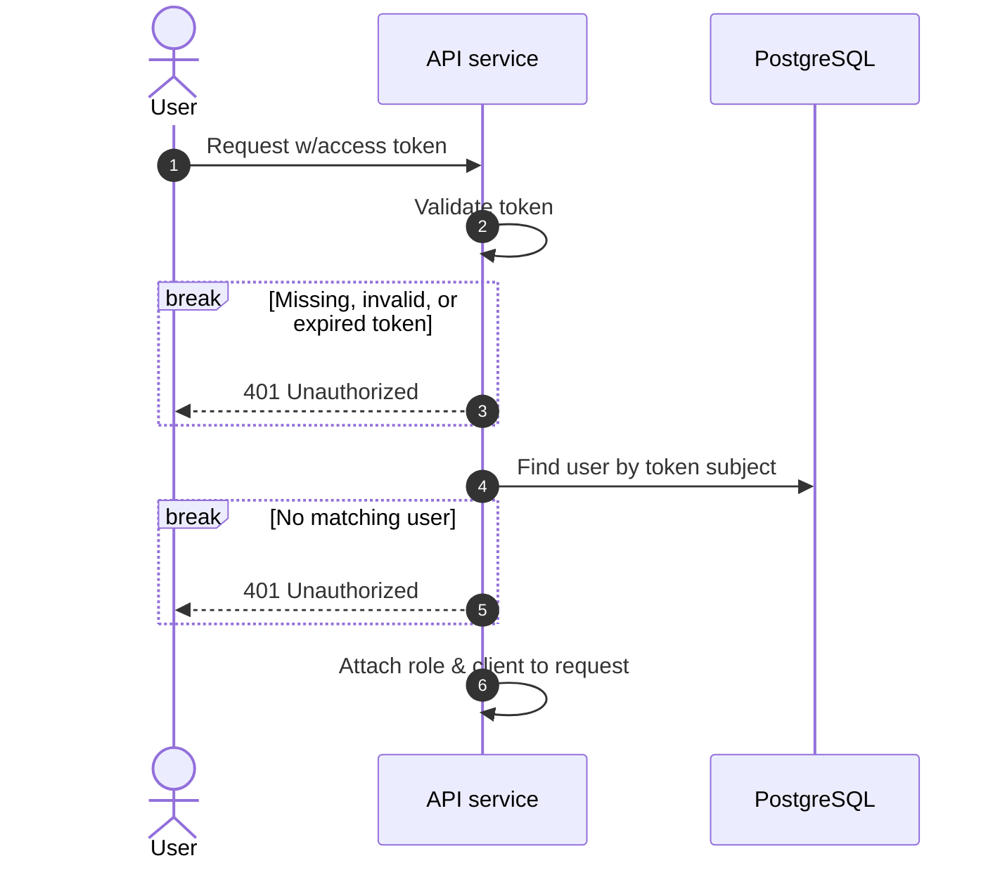
```mermaid
sequenceDiagram
    autonumber
    actor u as User
    participant api as API service
    participant db as PostgreSQL
    u->>api: Request w/access token
    api->>api: Validate token
    break Missing, invalid, or expired token
        api-->>u: 401 Unauthorized
    end
    api->>db: Find user by token subject
    break No matching user
        api-->>u: 401 Unauthorized
    end
    api->>api: Attach role & client to request
```

#### Engagement access
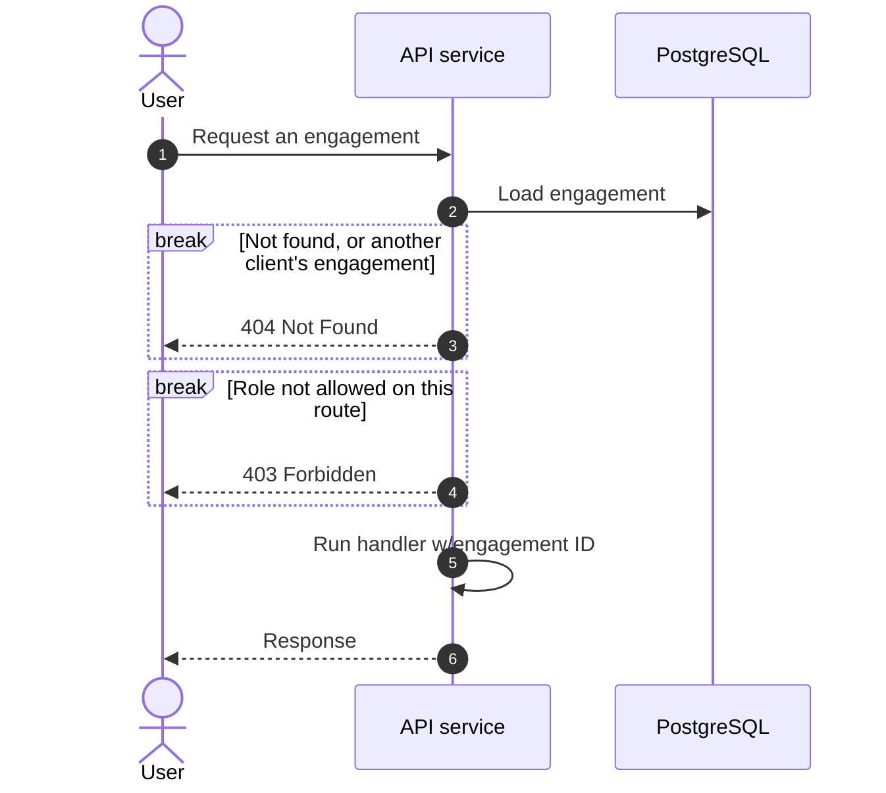
```mermaid
sequenceDiagram
    autonumber
    actor u as User
    participant api as API service
    participant db as PostgreSQL
    u->>api: Request an engagement
    api->>db: Load engagement
    break Not found, or another client's engagement
        api-->>u: 404 Not Found
    end
    break Role not allowed on this route
        api-->>u: 403 Forbidden
    end
    api->>api: Run handler w/engagement ID
    api-->>u: Response
    
```

### Engagement Setup Diagrams

#### Creating client & engagement
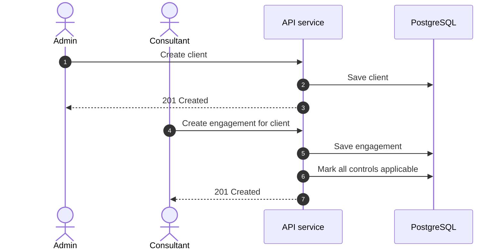
```mermaid
sequenceDiagram
        autonumber
        actor a as Admin
        actor c as Consultant
        participant api as API service
        participant db as PostgreSQL
        a->>api: Create client
        api->>db: Save client
        api-->>a: 201 Created
        c->>api: Create engagement for client
        api->>db: Save engagement
        api->>db: Mark all controls applicable
        api-->>c: 201 Created
```

#### Scope items
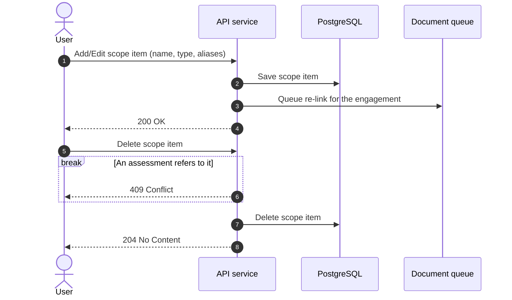
```mermaid
sequenceDiagram
        autonumber
        actor u as User
        participant api as API service
        participant db as PostgreSQL
        participant qu as Document queue
        u->>api: Add/Edit scope item (name, type, aliases)
        api->>db: Save scope item
        api->>qu: Queue re-link for the engagement
        api-->>u: 200 OK
        u->>api: Delete scope item
        break An assessment refers to it
            api-->>u: 409 Conflict
        end
        api->>db: Delete scope item
        api-->>u: 204 No Content
```

#### Applicability
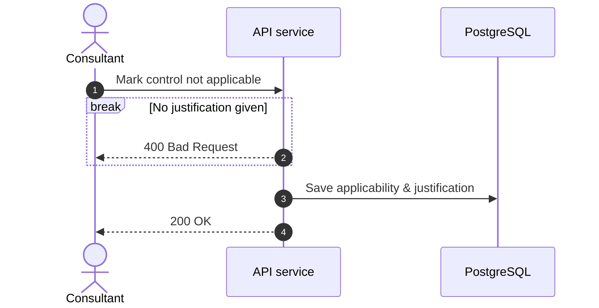
```mermaid
sequenceDiagram
        autonumber
        actor c as Consultant
        participant api as API service
        participant db as PostgreSQL
        c->>api: Mark control not applicable
        break No justification given
            api-->>c: 400 Bad Request
        end
        api->>db: Save applicability & justification
        api-->>c: 200 OK
```

#### Engagement state
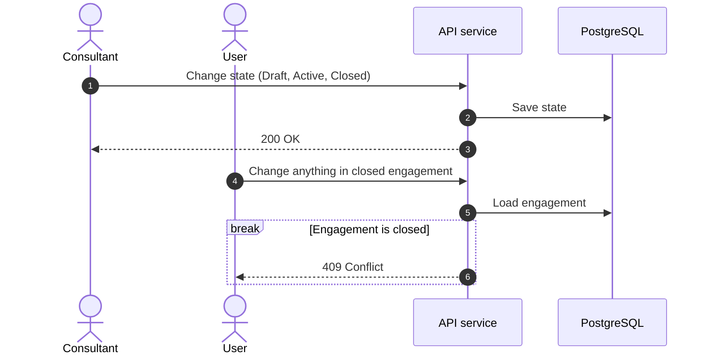
```mermaid
sequenceDiagram
        autonumber
        actor c as Consultant
        actor u as User
        participant api as API service
        participant db as PostgreSQL
        c->>api: Change state (Draft, Active, Closed)
        api->>db: Save state
        api-->>c: 200 OK
        u->>api: Change anything in closed engagement
        api->>db: Load engagement
        break Engagement is closed
            api-->>u: 409 Conflict
        end        
```

### Framework Management

#### Assessment criteria
```mermaid
sequenceDiagram
        autonumber
        actor a as Admin
        participant api as API service
        participant db as PostgreSQL
        a->>api: Add criteria version for control
        break Required fields missing
            api-->>a: 400 Bad Request
        end
        api->>db: Save version (inactive)
        api-->>a: 201 Created
        a->>api: Activate version
        critical Single transaction
            api->>db: Deactivate current version
            api->>db: Activate new version
        end
        api-->>a: 200 OK
```

### Deployment Diagrams

#### Prompt template change
```mermaid
sequenceDiagram
        autonumber
        actor dev as Developer
        participant ci as CI pipeline
        participant ws as Worker service

        dev->>dev: Add/Update template
        dev->>ci: Open pull request w/new version active
        ci->>ci: Build & test
        break Tests fail
            ci-->>dev: Failed, not merged
        end
        dev->>ci: Merge
        ci->>ws: Release
```

#### Release
```mermaid
sequenceDiagram
        autonumber
        actor dev as Developer
        participant ci as CI pipeline
        participant ecr as ECR
        participant mt as Migration task
        participant ecs as ECS services

        dev->>ci: Merge to main
        ci->>ci: Build and test
        break Build or tests fail
            ci-->>dev: Failed w/nothing deployed
        end
        ci->>ecr: Push image
        ci->>mt: Run migrations
        break Migrations fail
            ci-->>dev: Failed w/old version running
        end
        mt-->>ci: Done
        ci->>ecs: Deploy new image
        ecs->>ecs: Start new tasks, stop old ones once healthy
        ci-->>dev: Deployed
```

#### Catalog import
```mermaid
sequenceDiagram
        autonumber
        actor dev as Developer
        participant s3 as S3 bucket
        participant it as Import task
        participant db as PostgreSQL
        dev->>s3: Upload standards CSV
        dev->>it: Run import task
        it->>s3: Read CSV
        it->>it: Validate each row
        break Invalid row
            it-->>dev: Failed, no changes
        end
        it->>db: Insert/Update controls by reference ID
        it-->>dev: Summary of added/updated controls
```

#### Migrations
```mermaid
sequenceDiagram
        autonumber
        participant mt as Migration task
        participant db as PostgreSQL
        mt->>db: Read applied migrations
        mt->>db: Apply pending migrations
        Note over mt: Each migration must work w/version still runnincrg
```

### Miscellaneous Diagrams

#### Assessment influence
```mermaid
mindmap
  root((Assessment))
    App Scope
        Control Text
        Prompt Template
        Verdict Rules
    Firm Scope
        Assessment Criteria
    Engagement Scope
        Scope Items
        Evidence
```

**Rules the code keeps:**
- All data belongs to one engagement, and every query filters by it.
- Assessments and consultant decisions are never edited. A new run or decision adds a row.
- Code outside `Integrations/Aws/` uses only the interfaces in `Integrations/Abstractions/`.

## Build

Prerequisites:
- Visual Studio 2026 with the "ASP.NET and web development" workload, or the .NET 10 SDK with another editor
- Docker Desktop, for the local database and integration tests
- Node.js, only to regenerate `docs/schema.dbml`

Start the local database and apply the migrations first:

```
docker compose up -d
dotnet run --project src/App -- migrate
```

In Visual Studio:
1. Open `ComplianceBackend.slnx`.
2. Set `App` as the startup project and press F5.
3. Open `/health` to check the service and its database are up, and `/scalar` to browse the API.

From a terminal at the repository root:

```
dotnet build
dotnet run --project src/App
```

After adding a migration, regenerate the schema reference and commit it. CI fails if it is out of date.

```
powershell -File scripts/generate-schema-dbml.ps1
```

## Test

Start Docker first: integration tests run PostgreSQL in a container.

In Visual Studio, open **Test > Test Explorer** and choose **Run All**. From a terminal:

```
dotnet test
```

Each test declares the requirement it proves with a `[Requirement("ID", "text")]` attribute. A requirement that isn't built yet is a skipped test, so a skipped test is pending work, not a failure.